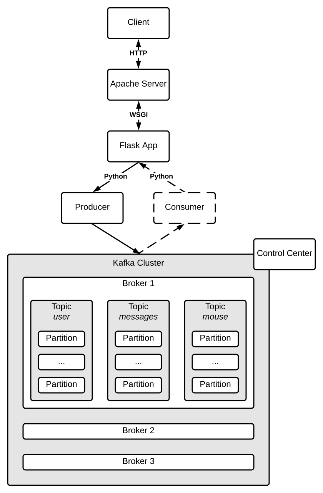

# Kafka Demonstrator

## Overview



## Components

* [Apache Server](https://httpd.apache.org/)
* Frontend as Web App by [Flask](https://flask.palletsprojects.com/en/1.1.x/)
* Backend as [Kafka](https://kafka.apache.org/) Cluster by [Confluent](https://www.confluent.de/)

## Getting started

```bash
docker compose up -d
```

## How to...

### Create topic

```bash
docker exec kafka2 kafka-topics --create --topic vks --bootstrap-server kafka2:29092 --replication-factor 2 --partitions 2
```

### Create consumer 
```bash
docker exec -it schema-registry bash
kafka-avro-console-consumer --topic vks --bootstrap-server kafka2:29092
```

### Create producer

```bash
docker exec -it schema-registry bash
$kafka-avro-console-producer --topic vks --bootstrap-server kafka2:29092 --property value.schema="$(< /opt/app/schema/user_login.avsc)"
```

### Access user interface

* [Frontend Web App](http://localhost:80)
* [Backend Control Center](http://localhost:9021)

## Acknowledgment

* Demonstrator based on [Confluent Tutorial](https://kafka-tutorials.confluent.io/kafka-console-consumer-producer/kafka.html)
* Docker containers from [Confluent Images](https://docs.confluent.io/platform/current/installation/docker/image-reference.html)
* Python client from [Confluent Package](https://pypi.org/project/confluent-kafka/)